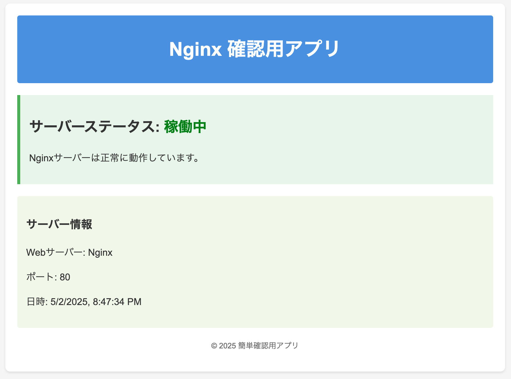

# ContainerForge: Azureコンテナ実践プロジェクト

<p align="center">
  
</p>


## プロジェクト概要

このプロジェクトは、Azure Container Appsを活用したアプリケーション実装の練習リポジトリです。

## 技術構成

- **Azure Container Apps**: コンテナベースのサーバーレスホスティング環境
- **Azure Container Registry**: コンテナイメージの保存・管理
- **Azure Log Analytics**: ログデータの収集・分析プラットフォーム

## 特徴

- App Serviceから脱却し、マイクロサービスアーキテクチャに適したAzure Container Appsを採用
- コンテナ化によるデプロイの一貫性と環境の再現性を実現
- Log Analyticsを用いたアプリケーションログの統合管理により、監視・トラブルシューティングを効率化

### 起動とデプロイ方法

以下のコードを実行してインフラを構築します。
```
bin/terraform_apply
```

#### 停止
以下のコードを実行すると停止できます。
```
bin/terraform_destroy
```
